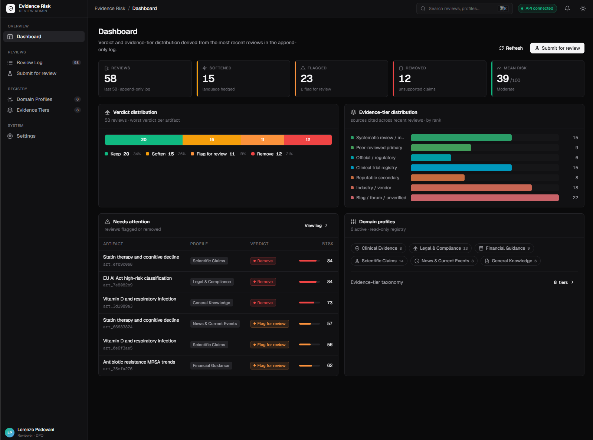

# Laravel Evidence Risk Review



[](composer.json)
[](composer.json)
[](LICENSE)
[](https://github.com/padosoft/laravel-evidence-risk-review/actions/workflows/ci.yml)

Evidence-aware risk review guardrails for Laravel applications, AI products, RAG systems, and MCP tools.

This package labels source strength, detects risky claims, keeps LLM calls default-OFF, records review evidence when enabled, and exposes the same core engine through PHP, Artisan, HTTP, and MCP surfaces.

## Table Of Contents

- [Why It Exists](#why-it-exists)
- [The Value It Adds](#the-value-it-adds)
- [Features](#features)
- [What Is Inside](#what-is-inside)
- [When The AI Steps In](#when-the-ai-steps-in)
- [Quick Start](#quick-start)
- [PHP Surface](#php-surface)
- [Artisan Surface](#artisan-surface)
- [HTTP Surface](#http-surface)
- [MCP Surface](#mcp-surface)
- [Configuration](#configuration)
- [Profiles And Taxonomy](#profiles-and-taxonomy)
- [Review Logs](#review-logs)
- [Testing](#testing)
- [Architecture](#architecture)
- [Security](#security)
- [Part Of The Padosoft AI Suite](#part-of-the-padosoft-ai-suite)
- [Contributing](#contributing)
- [License](#license)

## Why It Exists

LLM answers often look confident before they are well supported. `padosoft/laravel-evidence-risk-review` gives Laravel teams a deterministic review layer that can run before publishing, storing, streaming, or acting on AI-generated content.

The core idea is simple:

- classify every source into a configured evidence tier
- compare claim assertiveness against required evidence strength
- run cheap deterministic checks first
- call expensive or external LLM review only when explicitly enabled
- return structured findings that adapters can use consistently

## The Value It Adds

Most "AI safety" tooling either ships a heavyweight LLM judge that costs a token call on every request, or a regex blocklist that misses the real problem. This package sits in the middle and gives you the part that is hard to build well:

- **Cheaper by design.** Deterministic checks run first and resolve most artifacts for free. The expensive LLM pass is the exception, not the default — and it only runs when *you* turn it on.
- **Auditable, not magical.** Every result is a structured list of findings with the evidence tier, the claim, and the rule that fired. You can log it, diff it, and explain it to a compliance reviewer.
- **One engine, four doors.** The exact same `ReviewEngine` is reachable from PHP, Artisan, HTTP, and MCP. No drift between your API, your CLI, and your agent tools.
- **Domain-aware out of the box.** Ship-ready profiles for engineering, medical, legal, and finance encode "a definitive medical claim needs a peer-reviewed source, a blog does not count."
- **Truly standalone.** Zero coupling to any host app, knowledge base, or LLM SDK. You bind your own LLM contract; the package never picks a vendor for you.
- **Safe defaults.** HTTP, MCP, LLM, and persistence are all default-OFF. Installing it changes nothing until you opt in.

## Features

- ✅ **Evidence-tier labeling** — classify each source (guideline, peer-reviewed, official, preprint, news, blog, search hint, unverified) with configurable rules.
- ✅ **Risk sweep** — deterministic checks compare claim assertiveness against required evidence strength and flag unsupported, overconfident, or contradicted claims.
- ✅ **Default-OFF LLM review** — optional second pass through a host-provided `EvidenceReviewerLlmContract`; no LLM SDK ships in the package.
- ✅ **Five built-in profiles** — `default`, `engineering`, `medical`, `legal`, `finance`, each tuning which checks run and what minimum tier each assertiveness level requires.
- ✅ **Four surfaces, one engine** — PHP facade, Artisan commands, default-OFF HTTP API (OpenAPI 3.1), and framework-agnostic MCP tool registry.
- ✅ **Append-only review logs** — `null`, `array`, or `database` stores for an immutable evidence trail.
- ✅ **Stable contracts** — structured findings, a stable JSON error envelope, and deterministic Artisan exit codes for CI gating.
- ✅ **Standalone & host-agnostic** — no AskMyDocs, knowledge-base, or host-namespace dependency; enforced by architecture tests.

## What Is Inside

| Surface | Purpose |
| --- | --- |
| PHP service and facade | Direct package API for Laravel code. |
| Artisan commands | Local review, profile, taxonomy, and log inspection. |
| HTTP API | Default-OFF REST endpoints with OpenAPI 3.1. |
| MCP registry | Framework-agnostic tool definitions and handlers. |
| Review logs | Null, in-memory, and database append-only stores. |
| Profiles | Built-in default, engineering, medical, legal, and finance profiles. |

## When The AI Steps In

This package is **not** an LLM wrapper. By default it never calls a model — every review you saw above runs on pure, deterministic PHP. That keeps reviews fast, free, and reproducible.

The LLM pass exists for the cases deterministic rules cannot judge alone: nuanced claim-vs-source semantic alignment, paraphrase detection, or subtle contradictions. Here is the decision flow:

```text
1. Label every source into an evidence tier            (deterministic, always)
2. Run the risk sweep: assertiveness vs required tier   (deterministic, always)
3. llm.enabled === true AND a contract is bound?
       no  -> return deterministic findings             (done, zero token cost)
       yes -> run the LLM reviewer for semantic checks   (only now is a model called)
4. Merge findings, optionally persist, return result
```

Turn it on only when you need it, and only after binding your own reviewer:

```php
// In a service provider of the HOST app — the package ships no LLM SDK.
$this->app->bind(
    \Padosoft\EvidenceRiskReview\Contracts\EvidenceReviewerLlmContract::class,
    \App\Ai\MyEvidenceReviewer::class,
);
```

```env
EVIDENCE_RISK_REVIEW_LLM_ENABLED=true
```

If `llm.enabled` is `true` but no contract is bound, the engine fails loudly instead of silently skipping the AI step.

## Quick Start

Install the package:

```bash
composer require padosoft/laravel-evidence-risk-review
```

Publish config and the optional database migration:

```bash
php artisan vendor:publish --tag=evidence-risk-review-config
php artisan vendor:publish --tag=evidence-risk-review-migrations
```

Run a dry review from PHP:

```php
use Padosoft\EvidenceRiskReview\Data\ReviewArtifact;
use Padosoft\EvidenceRiskReview\Facades\EvidenceRiskReview;

$result = EvidenceRiskReview::review(new ReviewArtifact(
    artifactId: 'answer-123',
    answerText: 'This likely helps when the documented prerequisites are met.',
));

return $result->toArray();
```

You get back a structured result you can inspect, log, or gate on — something like:

```php
[
    'review_id'      => 'rev_...',
    'artifact_id'    => 'answer-123',
    'profile_key'    => 'default',
    'findings'       => [],        // each finding names the claim, the tier, and the rule that fired
    'claim_verdicts' => [],
    'source_tiers'   => [],
    'risk_score'     => 0,
    // ...budget, reviewed_at, metadata
]
```

Run the same review from the CLI:

```bash
php artisan evidence:review artifact.json --dry-run
```

The command exits `0` when there are no findings and `2` when findings exist, so it drops straight into a CI gate.

That is the whole loop. Enable nothing else until you need it — HTTP, MCP integrations, LLM calls, and persistence are all opt-in and stay off until you turn them on.

## PHP Surface

```php
use Padosoft\EvidenceRiskReview\Facades\EvidenceRiskReview;

$arrayResult = EvidenceRiskReview::reviewArray([
    'artifact_id' => 'answer-124',
    'answer_text' => 'This always cures the condition.',
    'claims' => [[
        'id' => 'c1',
        'text' => 'This always cures the condition.',
        'assertiveness' => 'definitive',
        'source_ids' => ['s1'],
    ]],
    'sources' => [[
        'id' => 's1',
        'declared_tier' => 'blog',
    ]],
    'options' => [
        'profile_key' => 'medical',
        'dry_run' => true,
    ],
]);

$tier = EvidenceRiskReview::labelTier([
    'id' => 'source-1',
    'url' => 'https://arxiv.org/abs/1234.5678',
]);

$profiles = EvidenceRiskReview::listProfiles();
$taxonomy = EvidenceRiskReview::taxonomy();
```

## Artisan Surface

```bash
php artisan evidence:review artifact.json --dry-run
php artisan evidence:profiles
php artisan evidence:taxonomy
php artisan evidence:log --limit=25
```

`evidence:review` exits with:

| Code | Meaning |
| --- | --- |
| `0` | Review completed and no findings were produced. |
| `2` | Review completed and findings were produced. |
| `1` | Invalid input, unknown profile, unavailable dependency, or runtime failure. |

## HTTP Surface

The HTTP API is default-OFF. Enable it explicitly:

```php
'api' => [
    'enabled' => env('EVIDENCE_RISK_REVIEW_API_ENABLED', false),
    'prefix' => env('EVIDENCE_RISK_REVIEW_API_PREFIX', 'evidence-risk-review/api'),
    'middleware' => [],
],
```

Available endpoints when enabled:

```text
POST /evidence-risk-review/api/reviews
GET  /evidence-risk-review/api/reviews/{review}
GET  /evidence-risk-review/api/profiles
GET  /evidence-risk-review/api/profiles/{key}
GET  /evidence-risk-review/api/taxonomy
GET  /evidence-risk-review/api/openapi.yaml
```

HTTP errors use a stable envelope:

```json
{
  "error": {
    "code": "validation_error",
    "message": "Expected non-empty string at [artifact_id].",
    "details": {}
  }
}
```

## MCP Surface

The MCP layer is framework-agnostic:

```php
use Padosoft\EvidenceRiskReview\Mcp\McpToolRegistry;

$registry = app(McpToolRegistry::class);

$definitions = array_map(
    static fn ($definition) => $definition->toArray(),
    $registry->definitions(),
);

$result = $registry->handle('evidence_review.assess', [
    'artifact_id' => 'answer-125',
    'answer_text' => 'No claims to check.',
    'options' => ['dry_run' => true],
]);
```

Available tools:

```text
evidence_review.assess
evidence_review.label_tier
evidence_review.list_profiles
```

## Configuration

The package config is published to `config/evidence-risk-review.php`.

Important defaults:

| Key | Default | Effect |
| --- | --- | --- |
| `api.enabled` | `false` | HTTP routes are not registered unless enabled. |
| `mcp.enabled` | `false` | Hosts decide if and how to expose MCP tools. |
| `llm.enabled` | `false` | No external LLM calls happen by default. |
| `review_log.store` | `null` | No persistence unless `array` or `database` is configured. |
| `default_profile` | `default` | Review profile used when no option is supplied. |

See `.env.example` for the supported environment variables.

## Profiles And Taxonomy

Built-in profiles:

- `default`
- `engineering`
- `medical`
- `legal`
- `finance`

Evidence tiers are configurable. Built-ins include guideline, peer-reviewed, official, preprint, news, blog, search hint, and unverified.

Profiles decide which risk checks are enabled and what minimum source tier each claim assertiveness level requires.

## Review Logs

Supported stores:

- `null`: default, append is a no-op
- `array`: useful for tests and in-process inspection
- `database`: append-only table published through the package migration

Enable database logs:

```env
EVIDENCE_RISK_REVIEW_LOG_STORE=database
EVIDENCE_RISK_REVIEW_LOG_CONNECTION=mysql
EVIDENCE_RISK_REVIEW_LOG_TABLE=evidence_risk_review_logs
```

## Testing

Local gates:

```bash
composer validate --strict --no-interaction --no-ansi
vendor/bin/pint --test
vendor/bin/phpstan analyse --memory-limit=512M --no-progress
vendor/bin/phpunit
npx --yes @redocly/cli@latest lint resources/openapi.yaml
```

Live tests are opt-in and skip unless explicitly enabled:

```bash
EVIDENCE_RISK_REVIEW_LIVE=1 vendor/bin/phpunit --testsuite Live
```

## Architecture

The package keeps one core engine and thin adapters:

```text
ReviewArtifact / ReviewOptions
        |
        v
ReviewEngine
        |
        +-- EvidenceTierLabeler
        +-- RiskSweepEngine
        +-- EvidenceReviewerLlmContract
        +-- ReviewLogStore
        |
        v
PHP facade / Artisan / HTTP / MCP
```

Business rules live in core services and DTOs. Controllers, commands, and MCP handlers adapt input and output only.

## Security

- LLM calls are default-OFF.
- HTTP routes are default-OFF.
- Review logging is default-OFF.
- Unknown config values fail loudly.
- The package has no AskMyDocs or host-app namespace dependency.

Report vulnerabilities through the process in [SECURITY.md](SECURITY.md).

## Part Of The Padosoft AI Suite

`padosoft/laravel-evidence-risk-review` is one of the **Padosoft AI sister packages** — a family of standalone, host-agnostic Laravel building blocks for shipping trustworthy AI features. Each is independent, but they compose cleanly:

| Package | What it does |
| --- | --- |
| **[padosoft/laravel-evidence-risk-review-admin](https://github.com/padosoft/laravel-evidence-risk-review-admin)** | 🤩 A gorgeous web admin panel for this package — browse reviews, findings, evidence tiers, and profiles from a cross-mounted SPA. The visual companion to the engine. |
| [padosoft/laravel-ai-regolo](https://github.com/padosoft/laravel-ai-regolo) | EU-based Regolo.ai provider adapter for `laravel/ai` (chat, streaming, embeddings, reranking). |
| [padosoft/laravel-pii-redactor](https://github.com/padosoft/laravel-pii-redactor) (+ `-admin`) | EU-grade field-level PII detection and masking inside the app boundary. |
| [padosoft/laravel-flow](https://github.com/padosoft/laravel-flow) (+ `-admin`) | Saga engine with approval gates, webhook outbox, and replay for AI workflows. |
| [padosoft/eval-harness](https://github.com/padosoft/eval-harness) (+ `-ui`) | Golden datasets, RAG metrics, cohorts, adversarial testing, and LLM-as-judge regression gates. |

These packages power **[lopadova/askmydocs](https://github.com/lopadova/askmydocs)**, Padosoft's RAG platform — which integrates this evidence-tier and risk-review engine to surface low-confidence claims directly in its RAG prompts. If you want the full governed RAG stack rather than a single building block, start there.

## Contributing

Read [CONTRIBUTING.md](CONTRIBUTING.md), `AGENTS.md`, `CLAUDE.md`, `docs/RULES.md`, and `docs/LESSON.md` before opening a PR.

The repo includes a Claude/agent/vibe-coding pack under `.claude/` and `skills/` so future agent sessions inherit the project rules.

## License

Apache-2.0. See [LICENSE](LICENSE).
