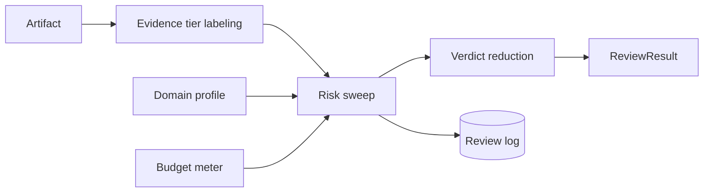

# Pipeline Workflow

## Motivation

The pipeline is cheap-first and auditable: label sources, sweep risks, reduce verdicts, persist log, return result.

## Theory

Evidence risk review treats an answer as a set of claims $C = \{c_1, c_2, ..., c_n\}$ and sources $S = \{s_1, s_2, ..., s_m\}$. Each source receives a tier rank $r(s) \in [0,100]$. A claim with assertiveness $a(c)$ has a profile-specific minimum rank $t(a,c)$. A deterministic gap is:

$$
g(c) = \max(0, t(a,c) - \max_{s \in S_c} r(s))
$$

The package then combines evidence gaps, profile checks, and verdict precedence into a stable ReviewResult.

## Design + Diagram



## Data Model / Contract

Pipeline inputs are immutable DTOs; outputs are serializable DTOs.

| Field | Meaning |
| --- | --- |
| artifact_id | Host-defined stable identifier. |
| claims | Discrete claims extracted by the host. |
| sources | Cited evidence with optional tier hints. |
| profile_key | Risk profile used for thresholds and checks. |
| findings | Structured review findings emitted by checks. |

## ADR

::: collapsible "Problem: adapters tend to grow business logic"
Decision: keep PHP facade, Artisan, HTTP, and MCP as thin adapters over ReviewEngine.

Consequences: there is one behavior to test, but adapters must validate input carefully.
:::

::: collapsible "Problem: external review can become expensive"
Decision: run cheap deterministic checks first and spend LLM budget only when enabled and useful.

Consequences: default installs have zero token cost, but hosts must bind an LLM contract for semantic review.
:::

## Worked Example

```text
Artifact -> Label -> Sweep -> Reduce -> Log -> Result
```

## Gotcha / Limits

::: callout warning
The package reviews evidence strength and risk boundaries; it does not retrieve sources, extract claims automatically, or replace human review for regulated decisions.
:::
