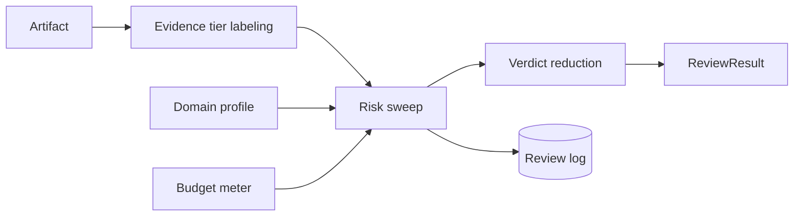

# Laravel Evidence Risk Review

Evidence-boundary labeling and risk-sweep guardrails for Laravel AI products, RAG systems, review pipelines, and MCP tools.

::: callout tip
Official docs URL: [https://doc.laravel-evidence-risk-review.padosoft.com](https://doc.laravel-evidence-risk-review.padosoft.com)
:::

::: grids
::: grid
::: card "Quickstart" icon:rocket
Install the package, publish config, and run your first deterministic review.

[Open ->](/quickstart)
:::
::: card "Architecture" icon:network
Understand why every public surface delegates to the same ReviewEngine.

[Open ->](/architecture/overview)
:::
::: card "Reference" icon:file-code
Use the PHP, CLI, HTTP, MCP, and config reference pages.

[Open ->](/reference/php)
:::
:::
:::

## What This Package Does

It answers a narrow but important question: not just whether a citation exists, but whether the cited evidence is strong enough for this claim, in this domain, for this population or boundary condition.

## Core Guarantees

- Standalone Laravel package: no host application coupling.
- HTTP, MCP, LLM, and persistence are default-OFF.
- No hard LLM SDK dependency.
- One core engine behind PHP, Artisan, HTTP, and MCP surfaces.
- Append-only review log when persistence is enabled.

## Mathematical Sketch

A simplified risk score can be read as a normalized aggregate over per-claim severity and evidence gap:

$$
R = \frac{1}{|C|} \sum_{c \in C} severity(c) \cdot gap(c)
$$

See [Risk Score](/concepts/risk-score) for the deeper model.
