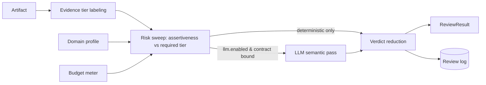

# laravel-evidence-risk-review


> **laravel-evidence-risk-review is the deterministic review layer that runs *before* you publish, store, stream or act on AI-generated content.**
> It labels how strong each source actually is, compares that against how confident each claim sounds,
> and flags the unsupported, overconfident and contradicted ones — for free, in pure PHP, with an
> auditable trail. The expensive LLM pass is the exception you opt into, never the default.

::: callout info "New here? Read this page top to bottom" icon:compass
In five minutes you'll know exactly what this package is, the problem it solves, why it beats both the
"LLM judge on every request" and the "regex blocklist" approaches, and where to click next. Every
other page goes deeper — this one gives you the whole picture.
:::

---

## What it is — in one minute

LLM answers **look confident before they're well supported**. A model will state "this always cures the
condition" and cite a blog post with the same calm tone it uses for a peer-reviewed guideline. Citations
existing is not the same as the cited evidence being *strong enough* for this claim, in this domain.

`laravel-evidence-risk-review` is a standalone Laravel package that closes that gap with a single core
`ReviewEngine`:

- **Label every source** into a configured evidence tier — guideline, peer-reviewed, official, preprint,
  news, blog, search hint, unverified — with rules you control.
- **Sweep every claim** — compare how assertive it is (`definitive`, `likely`, …) against the minimum
  tier its domain profile requires, and flag what doesn't clear the bar.
- **Stay cheap and deterministic** — these checks run in pure PHP, always, at zero token cost. An optional
  LLM second pass exists only for the nuanced semantic cases, and only when *you* turn it on.

> *In one line: not just whether a citation exists — whether the cited evidence is strong enough for **this** claim, in **this** domain, for **this** boundary condition.*

---

## The problem it solves

Every team shipping AI hits the same wall: confident output, weak grounding, and no deterministic way to
catch it before it ships. Here is the gap this package closes.

| Without laravel-evidence-risk-review | With laravel-evidence-risk-review |
|---|---|
| A definitive medical claim cites a blog and your app publishes it with full confidence. | The risk sweep compares assertiveness against the profile's required tier and **flags the mismatch** before publish. |
| "Does a citation exist?" is the only check — strength of evidence is invisible. | Every source is **labeled into an evidence tier**; a guideline and a forum post are never treated the same. |
| "AI safety" means an LLM judge billing a token call on **every** request. | Deterministic checks resolve most artifacts **for free**; the LLM pass is opt-in and the exception. |
| Results are an opaque "blocked / allowed" you can't explain to a reviewer. | Each result is a **structured list of findings** — the claim, the tier, the rule that fired — you can log, diff and audit. |
| Your API, CLI and agent tools each re-implement the rules and drift apart. | **One `ReviewEngine`** behind PHP, Artisan, HTTP and MCP — zero drift across surfaces. |
| Installing a safety tool changes behavior and adds an LLM vendor dependency. | **HTTP, MCP, LLM and persistence are default-OFF**; no LLM SDK ships — you bind your own contract. |
| Every domain needs the same rigor, but "definitive" means different things in medicine vs. a changelog. | **Domain profiles** (medical, legal, finance, engineering, default) encode per-domain evidence requirements. |

---

## Who it's for

::: grids
  ::: grid
    ::: card "RAG builders" icon:layers
    Surface low-confidence claims directly in your retrieval pipeline. Label retrieved sources, sweep the generated answer, and gate or annotate before it reaches the user.
    :::
  :::
  ::: grid
    ::: card "Regulated AI products" icon:scale
    Medical, legal and finance profiles encode "a definitive claim needs a peer-reviewed source, a blog does not count." Every verdict is an auditable, explainable finding.
    :::
  :::
  ::: grid
    ::: card "Review & moderation pipelines" icon:workflow
    Drop `evidence:review` into CI: it exits `2` when findings exist, so an overconfident, under-sourced artifact fails the gate just like a failing test.
    :::
  :::
  ::: grid
    ::: card "Agentic & MCP tool builders" icon:bot
    Expose the same engine as framework-agnostic MCP tools so an agent can check its own evidence before acting — same rules as your API and CLI, no drift.
    :::
  :::
:::

---

## Why it's different — the moats

Most tools either **judge** content with an expensive model on every call, or **block** it with a brittle
regex list. This package does the hard middle part — deterministic, auditable, host-agnostic.

::: grids
  ::: grid
    ::: card "Evidence-tier labeling, not just citation-presence" icon:tags
    Each source is classified into a configurable tier (guideline → peer-reviewed → official → preprint → news → blog → search hint → unverified). The question is *strength*, not mere existence.
    :::
  :::
  ::: grid
    ::: card "Deterministic risk sweep" icon:radar
    Claim assertiveness is matched against the minimum tier its profile requires, flagging unsupported, overconfident and contradicted claims — pure PHP, reproducible, zero token cost.
    :::
  :::
  ::: grid
    ::: card "Cheaper by design" icon:badge-euro
    Deterministic checks run first and resolve most artifacts for free. The expensive LLM pass is the exception, not the default — and it only runs when you explicitly enable it.
    :::
  :::
  ::: grid
    ::: card "Auditable, not magical" icon:scroll-text
    Every result is a structured list of findings with the evidence tier, the claim and the rule that fired. You can log it, diff it, and explain it to a compliance reviewer.
    :::
  :::
  ::: grid
    ::: card "One engine, four doors" icon:network
    The exact same `ReviewEngine` is reachable from PHP, Artisan, HTTP and MCP. No drift between your API, your CLI and your agent tools.
    :::
  :::
  ::: grid
    ::: card "Domain-aware out of the box" icon:graduation-cap
    Ship-ready profiles for `default`, `engineering`, `medical`, `legal` and `finance` tune which checks run and what minimum tier each assertiveness level requires.
    :::
  :::
  ::: grid
    ::: card "Default-OFF, safe to install" icon:shield-check
    HTTP, MCP, LLM and persistence are all OFF until you opt in. Installing the package changes nothing about your app's behavior — and unknown config values fail loudly.
    :::
  :::
  ::: grid
    ::: card "Truly standalone & host-agnostic" icon:box
    Zero coupling to any host app, knowledge base or LLM SDK — enforced by architecture tests. You bind your own LLM contract; the package never picks a vendor for you.
    :::
  :::
  ::: grid
    ::: card "Multi-tenant-safe" icon:building
    Bind a `TenantResolver` and every persisted review is stamped with the resolved tenant (the payload can't spoof it); log reads are forced to the current tenant so no one reads another's reviews.
    :::
  :::
:::

---

## See it: a review in three lines

A dry review needs no config, no persistence and no LLM — it runs the moment the package is installed:

```php
use Padosoft\EvidenceRiskReview\Data\ReviewArtifact;
use Padosoft\EvidenceRiskReview\Facades\EvidenceRiskReview;

$result = EvidenceRiskReview::review(new ReviewArtifact(
    artifactId: 'answer-123',
    answerText: 'This likely helps when the documented prerequisites are met.',
));
// $result->findings — each names the claim, the evidence tier, and the rule that fired.
```

---

## laravel-evidence-risk-review vs. the alternatives

| Capability | **laravel-evidence-risk-review** | Regex / keyword blocklist | LLM-judge on every request | Citation-presence check |
|---|:---:|:---:|:---:|:---:|
| Labels evidence *strength* per source (tiers) | ✅ | ❌ | ➖ | ❌ |
| Deterministic, reproducible verdicts | ✅ | ✅ | ❌ | ✅ |
| Zero token cost on the default path | ✅ | ✅ | ❌ | ✅ |
| Structured, auditable findings (claim · tier · rule) | ✅ | ❌ | ➖ | ❌ |
| Domain-aware profiles (medical/legal/finance…) | ✅ | ❌ | ➖ | ❌ |
| Optional LLM pass, opt-in for semantic cases | ✅ | ❌ | ➖ | ❌ |
| Same engine across PHP · CLI · HTTP · MCP | ✅ | ❌ | ❌ | ❌ |
| Self-hosted, no LLM SDK dependency | ✅ | ✅ | ❌ | ✅ |

> Legend: ✅ built-in · ➖ partial / extra cost / not exposed · ❌ not available.

---

## How it fits together

Each artifact flows through one engine: label every source into a tier, sweep every claim against its
profile's required tier, reduce to verdicts, and — only if you enabled it — run the LLM pass for the
nuanced cases before returning a structured `ReviewResult`.



A simplified risk score reads as a normalized aggregate over per-claim severity and evidence gap:

$$
R = \frac{1}{|C|} \sum_{c \in C} severity(c) \cdot gap(c)
$$

---

## Start in 30 seconds

::: steps
1. **Install the package**
   ```bash
   composer require padosoft/laravel-evidence-risk-review
   php artisan vendor:publish --tag=evidence-risk-review-config
   php artisan vendor:publish --tag=evidence-risk-review-migrations
   ```
   Nothing changes about your app's behavior — HTTP, MCP, LLM and persistence stay OFF until you opt in.

2. **Run your first deterministic review**
   ```php
   use Padosoft\EvidenceRiskReview\Data\ReviewArtifact;
   use Padosoft\EvidenceRiskReview\Facades\EvidenceRiskReview;

   $result = EvidenceRiskReview::review(new ReviewArtifact(
       artifactId: 'answer-123',
       answerText: 'This always cures the condition.',
   ));
   return $result->toArray(); // structured findings you can log, diff, or gate on
   ```

3. **Gate it in CI from the CLI**
   ```bash
   php artisan evidence:review artifact.json --dry-run
   # exits 0 when there are no findings, 2 when findings exist — drops straight into a CI gate
   ```
:::

**[→ Quickstart](/quickstart)** · **[→ Installation](/installation)** · **[→ Configuration](/configuration)**

---

## Batteries included for AI-assisted development

This repo ships **AI batteries** — a `CLAUDE.md` working guide, an `AGENTS.md` workflow contract and
invocable `.claude/skills/` encoding the TDD loop, the standalone-boundary rules, the default-OFF
discipline and the docs-sync process. Open the package in Claude Code, Cursor, Copilot or Codex and your
agent already knows the house rules.

---

## Where to go next

::: grids
  ::: grid
    ::: card "Quickstart" icon:rocket
    Install, publish config and run your first deterministic review in minutes. **[Open →](/quickstart)**
    :::
  :::
  ::: grid
    ::: card "Architecture" icon:network
    The one-engine, four-surface design and why every adapter delegates to the same `ReviewEngine`. **[Explore →](/architecture/overview)**
    :::
  :::
  ::: grid
    ::: card "PHP API Reference" icon:file-code
    The PHP, CLI, HTTP, MCP and config reference for every surface. **[Read →](/reference/php)**
    :::
  :::
:::

::: callout tip "Package facts" icon:info
Composer `padosoft/laravel-evidence-risk-review` · PHP `^8.3` · Laravel `13.x` · Apache-2.0 ·
HTTP · MCP · LLM · persistence all default-OFF · no LLM SDK dependency ·
[GitHub](https://github.com/padosoft/laravel-evidence-risk-review) · [Packagist](https://packagist.org/packages/padosoft/laravel-evidence-risk-review)
:::
